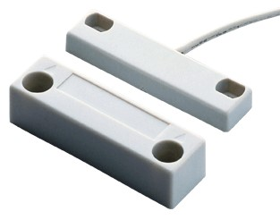

# PLC & Python

## PLC


- Programmable Logic Controller，簡稱PLC
- 先來看wiki的 [說明](https://zh.wikipedia.org/wiki/%E5%8F%AF%E7%BC%96%E7%A8%8B%E9%80%BB%E8%BE%91%E6%8E%A7%E5%88%B6%E5%99%A8)
- 今天 demo要用的PLC為[FATEK PLC](http://www.fatek.com/tw/prod.php?act=view&no=1)


## PLC 如何通訊?
- 各家自有協定
- 各種工業用常用protocol: modbus, canbus, ethercat...
- 今天要說明的是最常見的Modbus

## Modbus in Python
- 看一下[wiki說明](https://zh.wikipedia.org/wiki/Modbus)
- package: https://pypi.python.org/pypi/modbus_tk
  - https://github.com/ljean/modbus-tk/
- 使前先安裝一下套件
  - pip install serial
  - pip install modbus_tk
- example:
  - DI/DO/AI/AO的存取
  
## Python與PLC共舞
- demo1: 使用modbus控制PLC的relay輸出，點亮家中的照明用電燈
  - 家用110V E27 LED燈泡:  
  

- demo2: 使用modbus取得開關狀態-->常見的有保全使用的磁簧開關  
    
    - DI和DO混放，所以要查表才能了解
    - FATEK說明書的Modbus Table節錄  
    
  
- demo3: 讀電錶的資訊
    - 這邊的Demo範例是使用[士林電機電表](http://www.seec.com.tw/Content/Goods/GCont.aspx?SiteID=10&MmmID=655575436061073254&CatId=2015120316233269372&MSID=655575454164207353#ad-image-0)
  

### 會後補充
* 程式的說明有再增加一個jupyter notebook的說明範例，可以比較清楚的看到執行的結果，有興趣可以參考[這篇](Modbus.ipynb)

### 實作補充
- 在實際案場你在使用modbus/tcp時，也許會遇到設備回回來的header長度欄位是錯的，但後面帶的pdu資料卻是正確的，這時modbus_tk就沒辨法正常運作，可以參考以下的解法：

- 修改 python資料夾下 `Lib\site-packages\modbus_tk` 中的 `modbus_tcp.py`  (我使用的版本是 '0.5.10')，把 `_recv` 函式改成如下
```
    def _recv(self, expected_length=-1):
        """
        Receive the response from the slave
        Do not take expected_length into account because the length of the response is
        written in the mbap. Used for RTU only
        """
        to_be_recv_length = expected_length-2+6 #MB/TCP data length must add 6 byte header, sub 2 byte crc
        expected_pdu_length = expected_length-2
        response = to_data('')
        length = 255
        while len(response) < to_be_recv_length: #for H5A: length error issue
            rcv_byte = self._sock.recv(1)
            if rcv_byte:
                response += rcv_byte
                if len(response) == 6:
                    #to_be_recv_length = struct.unpack(">HHH", response)[2]
                    #length = to_be_recv_length + 6
                    if response[5] != expected_pdu_length:
                        print('length field of header error, fix: %s-->%s' %(response[5], expected_pdu_length))
                        response = response[:5] + struct.pack("B", expected_pdu_length)

            else:
                break
        retval = call_hooks("modbus_tcp.TcpMaster.after_recv", (self, response))
        if retval is not None:
            return retval
        return response
```

----
## Exception code 補充

- [link](https://product-help.schneider-electric.com/ED/ES_Power/PP-HJL_Modbus_Guide/EDMS/0611IB1302/0611IB13xx/NSX_MB_Modbus_Protocol/NSX_MB_Modbus_Protocol-5.htm)


